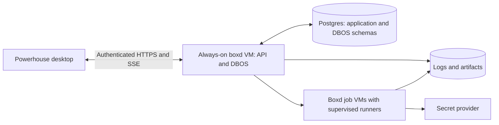

# DBOS workflows in Powerhouse

Implementation plan, updated 2026-09-23 after rebasing the script-job foundation and local draft page onto current `main` and implementing increment 0b: the `server/` DBOS coordinator with the durable two-script proof against a fake execution adapter. The live run UI is not yet implemented. No infrastructure was provisioned by these increments.

## Product outcome and assumptions

Powerhouse should let a user define, run, inspect, and recover repository workflows from one page. The first usable release runs a sequence of scripts against a pinned commit, streams progress, and recovers after the orchestrator restarts.

Confirmed requirement: workflows continue when Powerhouse is closed or the Mac is asleep, and execution runs on boxd infrastructure. Use an always-on TypeScript backend with DBOS and Postgres on boxd, executing jobs in separate boxd microVMs. Powerhouse is its desktop client. The precise database deployment and artifact-storage provider remain implementation choices to validate before provisioning.

Start with one owner and repository-scoped workflows. Include ownership in stored records and authenticate all access from the first remote release. Team role management, local execution, loops, nested graphs, automatic merging, and arbitrary retry-from-node are later scope.

## What already exists

- [Sidebar](../src/components/Sidebar.tsx) opens the [Workflows page](../src/features/workflows/WorkflowsPage.tsx) beside the persistent project navigation. Home or project/branch selection returns to the existing workspace without unmounting chats or terminals.
- [App](../src/App.tsx) renders terminals and the existing repository inspectors. Changing views must preserve mounted terminal instances.
- [WorkflowModal](../src/components/WorkflowModal.tsx) edits a repository's ordered merge-check commands.
- [Queue engine](../src-tauri/src/queue.rs) runs those checks in a throwaway local worktree, then lands the tested commit and optionally pushes. It keeps execution state and logs in memory.
- [App store](../src/store/appStore.ts) marks previously live queue entries interrupted on restart. [Persistence](../src/store/persist.ts) writes desktop state to `powerhouse.json`.
- [Queue synchronization](../src/lib/queueSync.ts) and [StepLog](../src/components/StepLog.tsx) provide useful status/log UI patterns, but their transport is local Tauri events.

- [Cloud runner](../cloud/runner/src/main.rs) already provides detached systemd execution, durable SQLite admission/claims, polling, cursor-based events, cancellation, deadlines and crash reconciliation. Agent execution prepares a pinned checkout, runs headless, validates and publishes a result branch.
- [Desktop cloud commands](../src-tauri/src/cloud/commands.rs) already provision isolated boxd machines from versioned snapshots, reconcile lost creation acknowledgements, hand over per-run credentials and manage park/release.
- [Local telemetry](../src-tauri/src/telemetry/mod.rs) now durably records ACP, PTY and merge-queue activity in SQLite. It is separate from the remote runner event store and is not a workflow coordinator.
- [Cloud protocol](../cloud/protocol/src/lib.rs) now supports script-only jobs alongside existing agent jobs. See [script job contract](workflow-script-jobs.md).

There is no DBOS coordinator, server-side workflow database or React Flow dependency yet. Reuse the existing runner and boxd lifecycle rules; do not build a second job supervisor. Desktop-owned provisioning/cleanup must move behind an always-on service for unattended multi-node workflows. Existing detached jobs alone do not meet that requirement.

### Current increment and next handoff

1. **Implemented locally (0a):** protocol-v3 script manifests, unprivileged shell execution, durable bounded output and exit results, cancellation/deadline handling, v2 agent compatibility and regression tests. Scripts never invoke a model or automatically publish Git changes.
2. **Implemented locally (0b):** [`server/`](../server/README.md), an isolated TypeScript service pinning `@dbos-inc/dbos-sdk` 5.0.2, `@boxd-sh/sdk` 0.2.10, `pg` 8.23.0 and `fastify` 5.12.5. It provides bearer authentication (`owner:token` material outside source control), application migrations for `workflow_runs` / `workflow_node_runs` / `workflow_run_events` kept separate from DBOS's schema, the `ExecutionAdapter` seam with `FakeExecutionAdapter` and `BoxdExecutionAdapter`, and the API `POST /v1/runs`, `GET /v1/runs/:id`, `POST /v1/runs/:id/cancel`, `GET /health`. The hard-coded two-script DBOS workflow persists stable job UUIDs, machine names and manifest timestamps before any external action, polls through short steps separated by `DBOS.sleep`, fails fast on nonzero exit, and only releases a VM after the job is terminal with `unit_active == false`. Admission commits a `pending_dispatch` run with its stable DBOS workflow ID before dispatch; a boot reconciler re-dispatches with the same ID.
3. **Verified 2026-09-23:** 22 vitest tests against a disposable Postgres (`initdb`/`pg_ctl`) cover duplicate admission producing one run, duplicate (UUID, manifest) producing one execution, changed manifest under the same UUID rejected, fail-fast blocking script 2, lost-response reconciliation and coordinator restarts after machine creation and after job acceptance recovering the original resources, completed results surviving restart, cancellation terminating the process before VM release, and cross-owner authorization isolation. The TypeScript manifest digest is byte-identical with `powerhouse-runner digest` for the protocol fixture (`696da089…51cc`). `cargo test --manifest-path cloud/Cargo.toml` (23 runner + 9 protocol tests, v2 agent fixtures unchanged) and `./scripts/verify.sh` pass.
4. **Before deployment (unchanged, requires explicit infrastructure authorization):** run `cloud/runner/tests/vm-integration.sh` on a dedicated disposable Linux/systemd VM, publish a clean runner snapshot, verify `probe.script_protocol_version == 3`, then run the two-script workflow through `BoxdExecutionAdapter`, restart the coordinator between nodes, and confirm VM/process cleanup after success, failure and cancellation. Also still open: where the coordinator's Postgres lives (shared backend VM with external backups versus managed hosting) and the artifact-storage provider.
5. **Next implementation increment:** the live run UI transport (increment 2) or publishing/admission of user-defined sequences (increment 1); the coordinator's admission, projection and event tables are ready for both.

The desktop also has a local-only draft builder: create named workflows per project, edit/reorder/remove script steps, and persist them in `powerhouse.json`. The page uses a simple sequence view, not React Flow. It explicitly disables Run until the server exists; drafts are neither published immutable versions nor executable workflows. Existing merge-check configuration is unchanged. The main sidebar remains outside the page and mounted; hidden project content is inert and project shortcuts cannot act on hidden chats. Settings and Telemetry retain their existing overlay behavior.

## Architecture

Start with one dedicated boxd backend VM containing the HTTP interface and DBOS worker. For the first deployment, Postgres can share this VM using persistent storage and database-aware backups outside the VM. This is a single-instance availability tradeoff, with recovery on restart; add independent database hosting and redundant workers when availability requirements justify them. DBOS uses Postgres for durable orchestration; keep product tables separate from its internal schema. [DBOS architecture](https://docs.dbos.dev/architecture)

Keep three modules with small interfaces:

- **Workflow module:** owns validation, publishing, run admission, orchestration, and control actions. The desktop invokes it through HTTP and reads snapshots/events.
- **Execution module:** owns job admission, process supervision, workspace lifecycle, resource limits, cancellation, and artifact references. Expose `submit`, `getStatus`, `cancel`, and cursor-based log access. Implement one real remote adapter first.
- **Workflow UI module:** owns drafts, canvas layout, selection, and run presentation. It does not decide whether a node can execute.

Proposed locations: `server/` for the backend, `packages/workflow-contracts/` for shared schemas, and `src/features/workflows/` for the desktop feature. Keep dependencies out of the browser bundle unless the desktop needs them.

### Boxd execution design

Use `@boxd-sh/sdk` in the backend for machine lifecycle and short control commands. Its exec timeout can end the request while leaving the process running, so a long SDK call is insufficient as the durable job interface. [Boxd TypeScript SDK](https://docs.boxd.sh/reference/typescript-sdk#exec)

Reuse the existing clean base-snapshot setup and Rust runner. Initially give every node attempt a fresh pinned checkout and isolated job VM, using explicit outputs rather than an implicitly shared mutable workspace. Workspace reuse is a later optimization with explicit leases and isolation rules. Publish templates under immutable names tied to a revision; a mutable snapshot alias is insufficient for reproducibility. Record and verify the resolved snapshot version, as the desktop already does. Boxd snapshots capture memory and disk, and re-saving a name changes what subsequent restores receive. [Boxd golden images](https://docs.boxd.sh/guides/golden-image)

Templates must contain no active job, DBOS worker, controller identity, or embedded credentials. The backend/database VM is never an execution template. Record the resolved template revision, machine ID and job ID on each execution. Machine provisioning needs the same response-loss reconciliation as job submission: persist the intended identity before creating a VM, serialize allocation, and resolve an uncertain result before trying again.

Keep the existing systemd supervisor and SQLite job store. Map a node attempt to a stable runner `run_id`; duplicate submission with the same manifest returns the original receipt, while changed content conflicts. `inspect`, `events`, `result` and `cancel` are the execution API over short remote commands. Wait for both terminal state and unit cleanup before releasing a VM. Upload artifacts before releasing storage. If a VM reboots and loses a process, the runner records interruption rather than silently rerunning side effects; surviving an orchestrator restart does not imply that an arbitrary agent process can survive a VM reboot.

Explicitly disable auto-suspend, auto-hibernate and automatic destruction on the backend VM. Disable suspension/hibernation for active execution VMs as well; restore an idle policy only after work is complete or deliberately waiting. Boxd idle timers follow inbound traffic, so CPU work and cron can otherwise freeze. [Boxd lifecycle behavior](https://docs.boxd.sh/guides/suspend-resume)

Use isolated execution VMs with narrowly supplied repository/model credentials; the controller alone holds machine-management authority. Boxd isolation removes account integrations and saved agent logins, so headless authentication must be provisioned explicitly. Do not assume a preinstalled agent has credentials in an isolated VM. [Boxd sandboxes](https://docs.boxd.sh/use-cases/sandboxes)

Maintain global admission and per-type limits, reserve capacity for the backend, and record workspace leases independently of running-node counts. Retained/paused workspaces still need a budget. On completion, upload artifacts before releasing the VM; retain failed workspaces for a bounded debugging window. A reconciler handles orphaned VMs and expired leases after controller failure. Confirm account limits during implementation instead of hard-coding documentation defaults.

## Data and contracts

| Record | Purpose and important fields |
| --- | --- |
| `workflows` | Stable identity, owner/workspace, project, name, current draft with revision, latest published version, archived flag. |
| `workflow_versions` | Append-only published graph, version number, graph schema version, node-handler versions, input/output schemas, content hash, publisher. |
| `workflow_triggers` | Workflow version, type, enabled state, typed configuration, creator, and DBOS schedule name where applicable. Add cron/webhook records when those features ship. |
| `workflow_runs` | Root DBOS workflow ID, workflow version, actor/trigger, admission key, validated inputs, repository and source SHA, execution profile, status projection, dispatch state, timestamps, parent/fork lineage. |
| `workflow_node_runs` | Run/node/logical-attempt identity, child DBOS workflow ID, boxd machine ID, template revision, external job ID, state, resolved inputs, bounded result or artifact references, timestamps and error. |
| `workflow_run_events` | Ordered run events with unique event identity, per-run cursor, node/attempt identity and bounded payload. Supports reconnect and audit without storing full logs here. |
| `workflow_approvals` | Added with approvals: run/node/attempt, requested action, authorized approver, deadline, one decision, actor and timestamp. |

Published versions cannot be edited or deleted while referenced. Editing produces a draft; publishing creates another version. Existing triggers continue pointing at their chosen version until explicitly changed. Use draft revision checks to prevent overwriting another edit.

Each node declares `id`, `type`, handler version, typed configuration, input bindings, output schema, secret references, execution requirements, timeout and retry policy. Use a discriminated schema shared by backend validation and the editor. Keep canvas positions separate from execution semantics.

Bindings support literals, workflow inputs, and named predecessor outputs. Reject unknown references, missing required inputs and incompatible types at publish time. Do not introduce arbitrary JavaScript evaluation for bindings or conditions.

DBOS owns execution checkpoints; application run/node statuses are projections for product queries. Update projections and append their events in one application transaction with deduplication. Reconcile projections after crashes and control actions; a canceled workflow cannot be relied on to run its own final status-writing step.

Run creation must survive a failure between inserting the product run and enqueueing DBOS. Commit a pending-dispatch run with a stable DBOS ID, then dispatch it. A reconciler retries unfinished dispatches using that same ID. Manual request keys and provider webhook delivery IDs identify duplicate admissions; differing payloads under an existing key are rejected.

## Execution semantics

Use one registered graph interpreter plus a registered node workflow. A graph node is a product concept; its implementation may require multiple DBOS steps.

The root interpreter loads the immutable version through a step, resolves ready nodes in stable order, starts node child workflows, and collects their results. Begin with sequences. Add parallel execution as deterministic ready-node batches; wait for the entire batch before scheduling the next batch. This trades some throughput for a simple replay model. DBOS requires deterministic step ordering and recommends child workflows for concurrent sequences of operations. [Workflow determinism](https://docs.dbos.dev/typescript/tutorials/workflow-tutorial#determinism)

DBOS queues schedule workflows, so queue the node child workflows. Give script, test, and agent work configurable limits, and apply a shared microVM admission limit across all types in the execution module. Waiting approvals must not occupy microVM capacity. Do not place a parent and its waiting children in the same constrained queue. [Queues and concurrency](https://docs.dbos.dev/typescript/tutorials/queue-tutorial)

For remote work, the node workflow performs:

1. A step submits or recovers a job using a stable execution key.
2. Short steps poll the durable job record, separated by `DBOS.sleep`.
3. A step records the bounded result and artifact references.

Persist a key for each node's logical execution attempt. Transport retries and orchestrator recovery reuse it; an explicitly requested new execution gets a new key. The runner must resolve repeated submissions to the same durable job, including response loss after acceptance. Validate this capability on boxd before promising duplicate-free launches.

DBOS does not make arbitrary external side effects exactly once: an interrupted step can run again. Unknown job outcomes must be reconciled instead of blindly submitting another process. A script or HTTP write also needs its own idempotency design if it may be deliberately re-executed. [Workflow guarantees](https://docs.dbos.dev/typescript/tutorials/workflow-tutorial#workflow-guarantees)

Pin three kinds of version: graph version, repository commit, and engine/handler code version. Keep compatible workers available for active runs when deploying engine changes; graph immutability alone does not preserve replay compatibility. [Upgrading workflow code](https://docs.dbos.dev/typescript/tutorials/upgrading-workflows)

### Graph rules

- DAGs only; reject cycles, duplicate IDs, invalid ports, missing references and disconnected nodes at publication.
- A normal node runs when all required predecessors succeed. Failure blocks downstream nodes. Independent work already running may finish; no new work is admitted after a fatal run failure in the initial policy.
- Condition nodes choose explicit output ports. Unselected paths become `skipped`. The initial editor permits structured branches that reconverge at an explicit merge with defined selected-branch semantics; arbitrary conditional joins wait until those semantics are implemented.
- Distinguish `pending`, `queued`, `running`, `waiting_approval`, `succeeded`, `failed`, `skipped`, `blocked`, `canceling`, `canceled`, and `timed_out` where applicable. A skipped condition path is different from a dependency blocked by failure.
- Define execution timeout separately from queue wait and overall run deadline. Store defaults in the published version so later default changes do not change active runs.

### Source and workspace rules

Each run references a remote repository and a resolved immutable commit. The first remote release supports commits available to the runner. Local-only repositories and unpushed/dirty changes need an explicit upload/snapshot feature later; starting a run must never silently push local code.

Initially every node gets a fresh checkout at its resolved commit. Nodes exchange explicit commits, patches, or artifact references; do not assume files created by an earlier script exist in the next checkout. Later, sequential nodes may share a leased workspace while parallel writers remain isolated. Retries that reuse earlier outputs require those outputs and any relevant workspace snapshot to remain available.

Record execution image/toolchain identity and resolve credentials on the runner. Bound job duration, workspace lifetime, output size and retained artifacts. Enforce a runner deadline and reap orphaned jobs after cancellation or worker loss. Retention must preserve references needed by active runs and supported recovery actions.

### Retries, cancellation, approvals

Retry transient submission/status failures with backoff. A nonzero script/test exit or failed agent task does not automatically start a new job by default. A lost poll response must not rerun the workload.

Cancel records durable intent, stops new dispatch, cancels the root and its children, and invokes runner cancellation for active jobs. Keep showing `canceling` until job termination is confirmed. DBOS cancellation takes effect at a subsequent step, and step timeouts are cooperative, so neither replaces remote process termination. [Workflow management](https://docs.dbos.dev/typescript/tutorials/workflow-management#cancelling-workflows), [step timeouts](https://docs.dbos.dev/typescript/tutorials/step-tutorial#step-timeouts)

Resume is available only when the DBOS state and external job state permit continuing the same execution. A permanently canceled process usually requires a fresh attempt rather than reusing its canceled job ID. Route resumed/forked node work through its configured queue so recovery cannot bypass limits. Keep the UI action unavailable until that path is tested.

Approval nodes create a durable request and wait on a unique run/node/attempt topic using `DBOS.recv` with an explicit deadline. The backend verifies the actor, atomically accepts one decision, and reliably forwards an idempotent notification. Rejection or expiry prevents the gated work; duplicate or late decisions cannot unlock another attempt. [DBOS workflow messages](https://docs.dbos.dev/typescript/tutorials/workflow-communication#workflow-messaging-and-notifications)

“Retry from this node” is a later product feature. DBOS fork starts from a recorded function ID, not a canvas node ID, and parallel child workflows require explicit mapping and possibly replacement children. Prove that mapping in a spike. A product retry creates a new run with lineage, reuses validated upstream results, invalidates the selected node and dependent outputs, and obtains fresh approvals for repeated actions. Do not enable arbitrary DAG retry before its semantics are tested. [DBOS fork reference](https://docs.dbos.dev/typescript/reference/methods#dbosforkworkflow)

## Triggers

Manual admission is part of the first release. It validates inputs and ownership and returns a stable run ID immediately.

Use DBOS's current dynamic scheduling interface for cron. It supports creating and updating database-backed schedules at runtime, including an explicit IANA timezone; the proposed minute-by-minute custom scheduler is unnecessary. Store trigger metadata and reconcile it with DBOS schedules using stable schedule names. Pass the pinned workflow version in the schedule context. Default to `Europe/Amsterdam`, skip missed runs unless backfill is enabled, and expose the next firing time. [Scheduling workflows](https://docs.dbos.dev/typescript/tutorials/scheduled-workflows)

Before enabling unattended triggers, implement an overlap policy. Start with skip-if-running per trigger; a durable admission check must enforce it. Define schedule-update races: an occurrence already admitted keeps its version, and future occurrences use the updated configuration. Test DST changes and backend downtime against the pinned SDK.

Webhooks verify signatures over the raw request body, enforce size and freshness limits, deduplicate provider delivery IDs and validate mapped inputs. They select a configured trigger, never an arbitrary graph or command supplied by the caller.

## One-page UI and access

Connect the existing Workflows sidebar item to a dedicated workspace view. Preserve the project navigation and mounted terminals. Within the workflow view:

- Left: workflow list, repository filter and last-run status.
- Center: shared React Flow renderer for edit and run modes.
- Right: typed configuration in edit mode; node state, attempts, input/output and logs in run mode.
- Bottom: run history. Put trigger configuration in its own tab within this area.
- Header: draft/published version, run identity, Run and Cancel; state-appropriate approval/recovery actions arrive with their corresponding backend support.

Start with a read-only graph run view and a template/imported sequence. Add graph editing after execution semantics work. Show status text/icons as well as colors, and provide a keyboard-accessible node list.

Use authenticated SSE for bounded status events with `Last-Event-ID` recovery. Fetch a snapshot plus cursor, then replay later events; if retention has expired, refetch a snapshot. Tail logs with independent job/attempt offsets and load older chunks on demand. Store full logs and artifacts in object storage. Reuse the existing log viewer's presentation, with a new transport and bounded rendering.

Backend authorization applies to definitions, run actions, approvals, streams and artifact downloads. Initially authenticate the owner/device and store credentials in the OS credential store. Restrict secret references to the authorized project and resolve actual secrets only inside execution. Redact secrets before persistence, including DBOS step results and logs. HTTP nodes need outbound destination rules that protect internal services and cloud metadata endpoints.

## Delivery plan

| Increment | Deliverable | Acceptance gate |
| --- | --- | --- |
| 0a. Script jobs (implemented, deployment pending) | Extend the existing runner with v3 scripts, bounded/redacted logs, exit results and tests; retain v2 agents. | Local protocol/process/store tests pass; dedicated Linux/systemd acceptance still required before snapshot publication. |
| 0b. Remote execution proof (implemented against the fake adapter; real-VM acceptance pending authorization) | Pin DBOS and boxd SDKs; minimal authenticated backend/Postgres; reuse the runner; own VM lifecycle and submit/status/cancel from the server. | Restart the orchestrator after machine creation and after job acceptance but before recording each response. Recovery finds the original resources; cancellation confirms process termination. Proven with `FakeExecutionAdapter`; the same gate must be repeated on real boxd infrastructure. |
| 1. Manual sequences | Shared schemas, migrations, immutable versions, run admission/reconciliation, script nodes, artifact references and owner authentication. Seed one repository workflow. | Duplicate start requests create one run; a two-script sequence keeps completed results after restart; a failed script blocks the next script. |
| 2. Run workspace | Working Workflows navigation, read-only graph, run history, inspector, snapshot/SSE reconnect, log tail, Cancel. | Close/reopen the desktop during a remote run; statuses and logs reconcile with no duplicate events or lost terminal sessions. |
| 3. Editor and DAGs | Draft/save/publish, typed forms/bindings, graph validation, parallel child workflows, shared capacity enforcement and condition semantics. | Invalid graphs cannot publish. Publishing v2 does not alter a v1 run. Parallel jobs obey both node-type and total capacity limits, including recovery. |
| 4. Useful automation | Headless agent jobs, e2e execution profiles/report artifacts, durable approvals. Reuse the script execution module where possible. | Agent process survives an orchestrator restart; output commit/patch feeds tests; unauthorized, duplicate and expired approval attempts cannot advance work. |
| 5. Unattended triggers | Dynamic cron, explicit overlap/backfill policy, signed webhooks and admission deduplication. | One run per delivery/occurrence; test downtime, repeated delivery, schedule edits, timezone/DST and overlapping runs. |
| 6. Recovery and migration | Supported Resume paths; constrained retry/fork with lineage; opt-in import of existing merge checks. | Reused outputs retain provenance; rerun descendants use fresh job identities; repeated actions require fresh approvals; existing merge behavior remains understood and tested. |

HTTP nodes can ship with increment 4 or 5 when a real workflow needs them. Treat e2e tests as script execution plus test-specific schemas, reports and artifacts. Treat agents as supervised headless jobs with explicit inputs, outputs, session/job identity and completion, rather than automating interactive terminals.

Keep the current merge queue during initial rollout. Import its ordered checks as a new draft graph, with a visible distinction between validating a branch commit and validating a merge candidate. Importing checks does not import automatic landing or `pushOnMerge`. Any later replacement must preserve per-repository serialization and test the exact candidate commit it intends to land; advancing the target branch invalidates that validation.

First release stop condition: an owner can run a published script sequence from Powerhouse, inspect durable progress and artifacts, cancel it, and recover through backend and desktop restarts. Then prioritize the first useful builder workflow: agent change → tests → human review.

Deployment is settled on boxd; a local execution mode is outside this plan. The execution primitive is the existing Rust/systemd runner. Remaining proof-stage decisions are the server's boxd transport integration, database backup/restore setup and artifact storage. These do not change the desktop/DBOS/execution separation.
